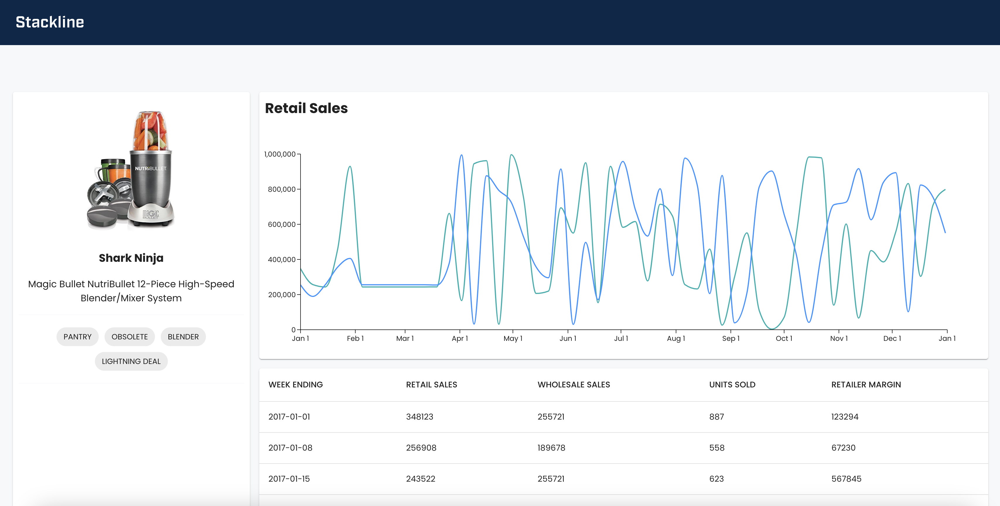

# stackline-oa

<a name="readme-top"></a>

[![Contributors][contributors-shield]][contributors-url]
[![Forks][forks-shield]][forks-url]
[![Stargazers][stars-shield]][stars-url]
[![Issues][issues-shield]][issues-url]
[![LinkedIn][linkedin-shield]][linkedin-url]

<!-- PROJECT LOGO -->
<div align="center">
<h3 align="center">Stackline Online Assessment</h3>

  <p align="center">
    Using the mock up, I created a working frontend application that mocks API calls to produce a graph and chart of various products.
    <br />
    <a href="https://github.com/kelliekumasaka/stackline-oa"><strong>Explore the docs »</strong></a>
    <br />
  </p>
</div>

<!-- TABLE OF CONTENTS -->
<details>
  <summary>Table of Contents</summary>
  <ol>
    <li>
      <a href="#about-the-project">About The Project</a>
      <ul>
        <li><a href="#built-with">Built With</a></li>
      </ul>
    </li>
    <li>
      <a href="#getting-started">Getting Started</a>
      <ul>
        <li><a href="#prerequisites">Prerequisites</a></li>
        <li><a href="#installation">Installation</a></li>
      </ul>
    </li>
    <li><a href="#usage">Usage</a></li>
    <li><a href="#roadmap">Roadmap</a></li>
    <li><a href="#contact">Contact</a></li>
    <li><a href="#acknowledgments">Acknowledgments</a></li>
  </ol>
</details>

<!-- ABOUT THE PROJECT -->

## About The Project



This project is a static `React` app that uses `msw` to mock API calls to render a JSON file, and `Redux` to store the call. I used the recommended `Redux Toolkit` with `Vite` and `TypeScript` template to get started and continued from there. On the app, there is a table, graph, and brief descriptiion of the produc that we are viewing. The graph takes the values of `Retail Sales` and `Wholesale Sales` and tracks them over time, while the table displays a row from each snapshot for each week over a year's time.

This simple app would be helpful for users who want to see metrics for the methods by which the product sells over time.

<p align="right">(<a href="#readme-top">back to top</a>)</p>

### Built With

- [![React][React.js]][React-url]
- [![Vite][Vite]][Vite-url]
- [![Typescript][Typescript]][Typescript-url]
- [![MUI][MUI]][Mui-url]
- [![Testing Library][testing-library]][Testing-Library-url]
- [![GitHub Actions][GitHub-Actions]][GA-url]
- [![NPM][NPM.com]][NPM-url]

<p align="right">(<a href="#readme-top">back to top</a>)</p>

<!-- GETTING STARTED -->

## Getting Started

Clone the repo to your local computer. If you haven't configured your GitHub tokens yet, you may need to do that first.

### Prerequisites

In order to run this app, you'll need to make sure `npm` is already installed on your machine and then run the following command within the repo in your terminal:

```sh
npm install npm@latest -g
```

<p align="right">(<a href="#readme-top">back to top</a>)</p>

<!-- USAGE EXAMPLES -->

## Usage

Currently, the app is only taking a static JSON file and rendering it. In the future, once the backend is up and running, we can take down the `msw` mock API worker that is being used to serve the JSON file and use it only for testing, and render data straight from our database.

<p align="right">(<a href="#readme-top">back to top</a>)</p>

<!-- ROADMAP -->

## Roadmap

- **Tests**: Testing is very slim right now, and if given the time, I'd like to go back and add more extenstive tests
- **Graph and Table**: Formatting for the graph is a bit off and sorting for the table is not available and I would want to go back and fix up those parts of the app as well

<p align="right">(<a href="#readme-top">back to top</a>)</p>

<!-- CONTACT -->

## Contact

Kellie Kumasaka - kelliek3@gmail.com

Project Link: [https://github.com/kelliekumasaka/stackline-oa](https://github.com/kelliekumasaka/stackline-oa)

<p align="right">(<a href="#readme-top">back to top</a>)</p>

<!-- ACKNOWLEDGMENTS -->

## Acknowledgments

- [ChatGPT](https://chatgpt.com/) helped me out of a really tough spot, and I couldn't have done this without them
- [StackOverflow](https://stackoverflow.com/) was a steady contributor and supporter of this project

<p align="right">(<a href="#readme-top">back to top</a>)</p>

<!-- MARKDOWN LINKS & IMAGES -->
<!-- https://www.markdownguide.org/basic-syntax/#reference-style-links -->

[contributors-shield]: https://img.shields.io/github/contributors/kelliekumasaka/stackline-oa.svg?style=for-the-badge
[contributors-url]: https://github.com/kelliekumasaka/stackline-oa/graphs/contributors
[forks-shield]: https://img.shields.io/github/forks/kelliekumasaka/stackline-oa.svg?style=for-the-badge
[forks-url]: https://github.com/kelliekumasaka/stackline-oa/network/members
[stars-shield]: https://img.shields.io/github/stars/kelliekumasaka/stackline-oa.svg?style=for-the-badge
[stars-url]: https://github.com/kelliekumasaka/stackline-oa/stargazers
[issues-shield]: https://img.shields.io/github/issues/kelliekumasaka/stackline-oa.svg?style=for-the-badge
[issues-url]: https://github.com/kelliekumasaka/stackline-oa/issues
[linkedin-shield]: https://img.shields.io/badge/-LinkedIn-black.svg?style=for-the-badge&logo=linkedin&colorB=555
[linkedin-url]: https://linkedin.com/in/kellie-kumasaka
[product-screenshot]: images/screenshot.png
[React.js]: https://img.shields.io/badge/React-20232A?style=for-the-badge&logo=react&logoColor=61DAFB
[React-url]: https://reactjs.org/
[Vite]: https://img.shields.io/badge/vite-%23646CFF.svg?style=for-the-badge&logo=vite&logoColor=white
[Vite-url]: https://Vitejs.dev/
[TypeScript]: https://img.shields.io/badge/typescript-%23007ACC.svg?style=for-the-badge&logo=typescript&logoColor=white
[Typescript-url]: https://www.typescriptlang.org/
[MUI]: https://img.shields.io/badge/MUI-%230081CB.svg?style=for-the-badge&logo=mui&logoColor=white
[Mui-url]: https://mui.com/
[testing-library]: https://img.shields.io/badge/-TestingLibrary-%23E33332?style=for-the-badge&logo=testing-library&logoColor=white
[Testing-Library-url]: https://testing-library.com/
[GitHub-Actions]: https://img.shields.io/badge/github%20actions-%232671E5.svg?style=for-the-badge&logo=githubactions&logoColor=white
[GA-url]: https://docs.github.com/en/actions
[NPM.com]: https://img.shields.io/badge/NPM-%23CB3837.svg?style=for-the-badge&logo=npm&logoColor=white
[NPM-url]: https://www.npmjs.com/
